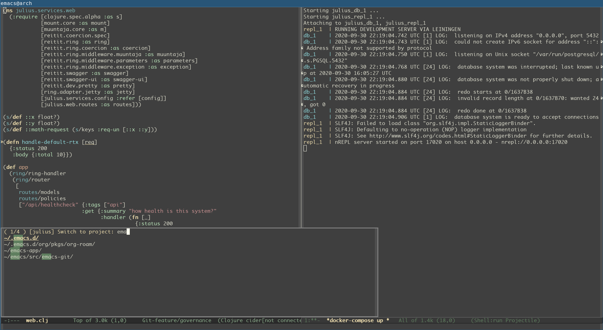

# Daily Emacs


### Installation

```bash
git clone --recurse-submodules https://github.com/wandersoncferreira/daily-emacs ~/.emacs.d
```


*Produced by current setup!*


### Update

This will run the pull command for all submodules cloned inside the
project.

```bash
~/.emacs.d/bin/update
```

